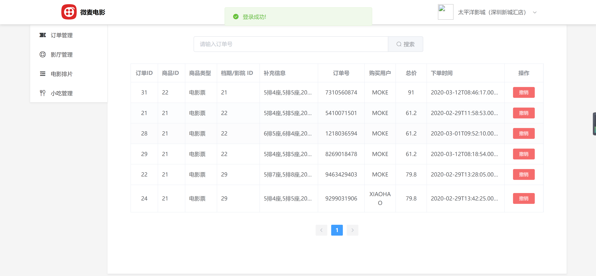
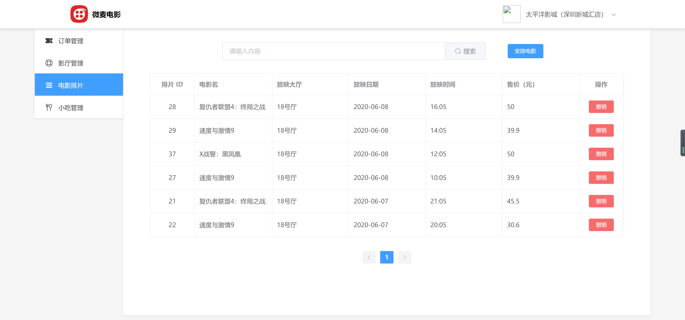
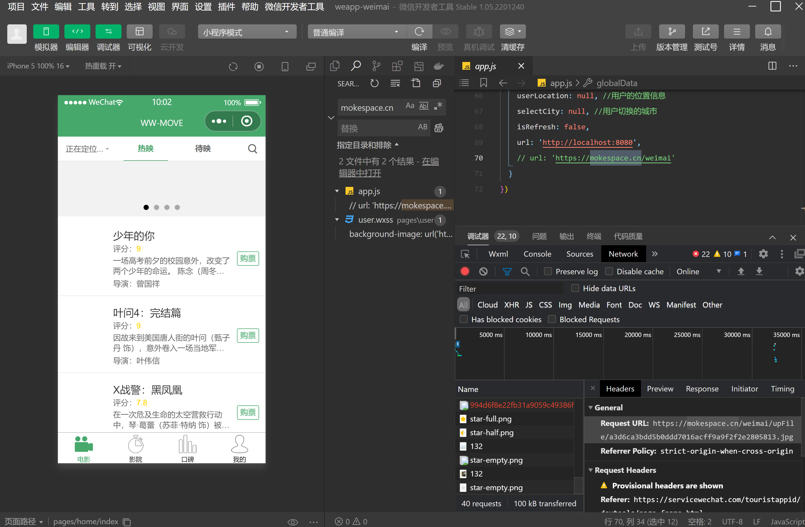
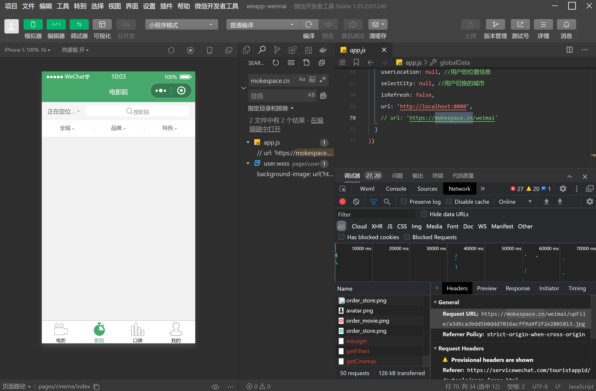
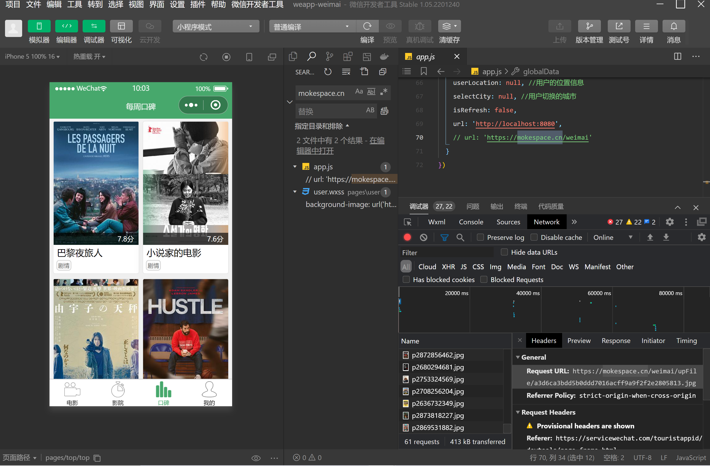
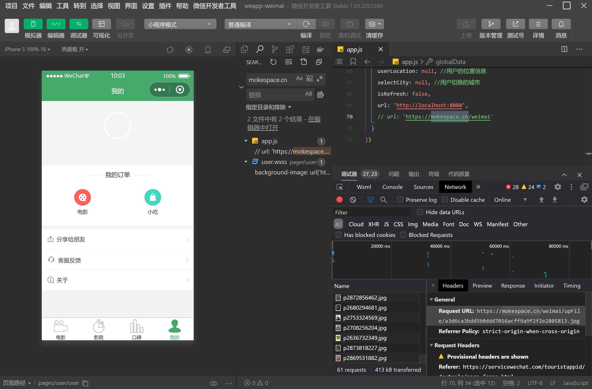

<h1 align="center">微麦电影购票系统</h1>

## 简介
微麦电影购票系统：角色分为管理员、用户；订单管理、电影排片、影厅管理、小吃管理，支持电影信息浏览与购票操作，集成微信小程序开发及调试工具。    --计算机毕业设计源码；毕设源码；java毕业设计源码

## 联系方式

<h3 align="center">获取完整代码与数据库文件 + 微信：deepguan QQ: 86050149 QQ群: 783742310</h3>

<h3 align="center">可帮忙远程部署 包运行成功！提供远程部署、修改代码、设计文档指导、代码讲解等服务！</h3>

## 功能介绍（完整见运行截图）
管理员：登录管理系统后，可进行订单管理，包括查看和取消电影票订单；管理电影排片，如显示及安排新的电影排片和取消排片；负责影厅和小吃的管理维护，通过导航菜单可快速访问各功能。提供开发和调试工具支持，以方便系统的调整和测试。

用户：可通过系统登录界面进入购票系统，浏览影片信息，如评分简介，进行购票操作；在电影排片功能上查看电影的基本信息，包括名称和票价；可在“我的订单”页面查看已购电影票及订单相关信息，并可进行订单操作。

## 运行截图

本代码来源于网络,仅供学习参考使用!

